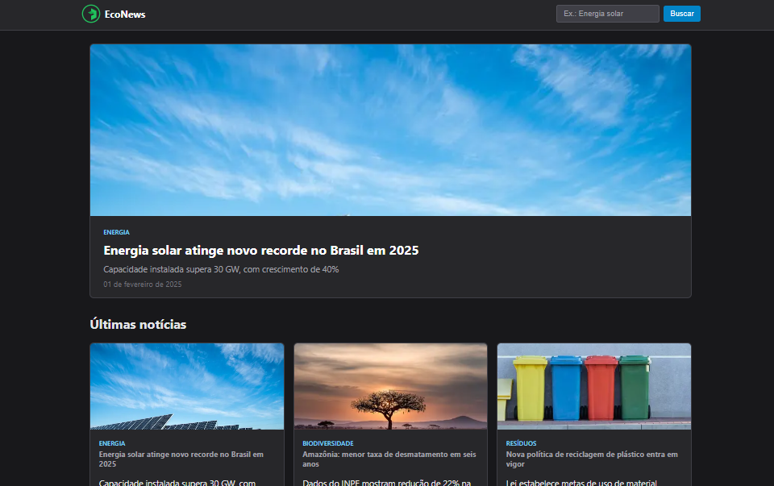

<p align="center">
  
</p>

<p align="center">
  <a href="#-projeto">Projeto</a>&nbsp;&nbsp;&nbsp;|&nbsp;&nbsp;&nbsp;
  <a href="#-tecnologias">Tecnologias</a>&nbsp;&nbsp;&nbsp;|&nbsp;&nbsp;&nbsp;
  <a href="#-funcionalidades">Funcionalidades</a>&nbsp;&nbsp;&nbsp;|&nbsp;&nbsp;&nbsp;
  <a href="#%EF%B8%8F-layout">Layout</a>&nbsp;&nbsp;&nbsp;|&nbsp;&nbsp;&nbsp;
  <a href="#licença-">Licença</a>
</p>

<p align="center">
  
  
  
  
</p>

---

<p align="center">
  
</p>

## 💻 Projeto

O **EcoNews** é uma aplicação web de **notícias sobre sustentabilidade e meio ambiente**, desenvolvida com foco em performance, acessibilidade e organização escalável utilizando o **App Router do Next.js**.

A aplicação simula um portal de conteúdo moderno, com listagem de notícias, destaque principal e páginas dinâmicas individuais para cada artigo.

O projeto foi estruturado com base em boas práticas de desenvolvimento front-end, priorizando:

- Componentização
- Separação de responsabilidades
- Acessibilidade (WCAG)
- Estrutura escalável para crescimento futuro

---

## 🌐 Acesso

🔗 **Aplicação:** https://econews-five.vercel.app/

---

## ⭐ Funcionalidades

### 📰 Listagem de notícias

- Grid responsivo de notícias
- Cards reutilizáveis
- Exibição de categoria, título, resumo e data
- Layout adaptado para diferentes tamanhos de tela

### 🌟 Destaque principal

- Notícia em destaque na homepage
- Imagem otimizada com `next/image`
- Hierarquia visual clara

### 🔎 Busca (UI preparada)

- Campo de busca no header
- Estrutura pronta para integração com filtro ou API

### 📄 Página dinâmica de notícia

- Roteamento dinâmico com `[slug]`
- Renderização baseada em dados
- Breadcrumb de navegação
- Exibição completa do artigo
- Imagem com caption
- Link de retorno para homepage

### ♿ Acessibilidade

- Skip link ("Pular para o conteúdo")
- Uso de `aria-label` e landmarks semânticos
- Foco visível para navegação via teclado
- Estrutura semântica com `header`, `main`, `article`

---

## 🚀 Tecnologias

Desenvolvido com:

- **Next.js (App Router)**
- **React**
- **TypeScript**
- **CSS global (customizado)**

### Recursos aplicados

- Roteamento dinâmico com App Router (`[slug]`)
- Componentização e reutilização de UI
- Tipagem estática com TypeScript
- Otimização de imagens com `next/image`
- Layout responsivo com CSS puro
- Boas práticas de acessibilidade (WCAG)
- Estrutura modular de arquivos
- Separação entre dados e apresentação

---

## 🖼️ Layout

O layout foi construído com foco em:

- Interface limpa e moderna
- Hierarquia visual clara (destaque + grid)
- Experiência de leitura confortável
- Responsividade (mobile-first)
- Consistência visual entre páginas
- Feedback de interação (hover, focus)

---

## ⚙️ Configuração do Projeto

### Pré-requisitos

- Node.js instalado
- NPM ou Yarn

### Passos

```bash
# Clone o repositório
git clone https://github.com/williammilanez/econews.git

# Acesse a pasta
cd econews

# Instale as dependências
npm install

# Execute o projeto
npm run dev
```

---

## 📚 Aprendizados Aplicados

Durante o desenvolvimento, foram aplicados conceitos importantes de engenharia front-end:

- Estruturação de aplicações com Next.js (App Router)
- Criação de rotas dinâmicas com slug
- Separação entre dados e camada de apresentação
- Construção de componentes reutilizáveis
- Boas práticas de acessibilidade web
- Uso correto de HTML semântico
- Responsividade com CSS moderno
- Organização de código voltada à escalabilidade
- Padronização de commits (Conventional Commits)

---

## 👨‍💻 Autor

Projeto desenvolvido durante os estudos na **Rocketseat**  
Implementado por **William Milanez**

📍 Pós-graduação Dev Start – _Econews - Sistema de Notícias com foco em Acessibilidade_.

---

## Licença 📄

Este projeto está sob a licença **MIT**.  
Projeto de uso educacional e livre para fins de estudo e prática pessoal.

---
